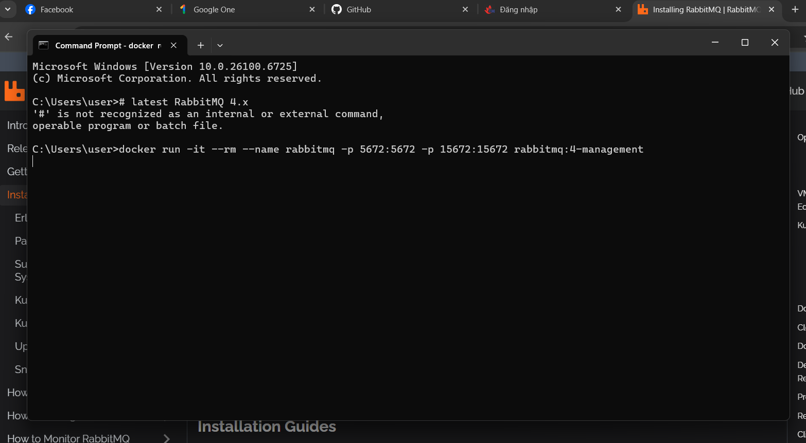
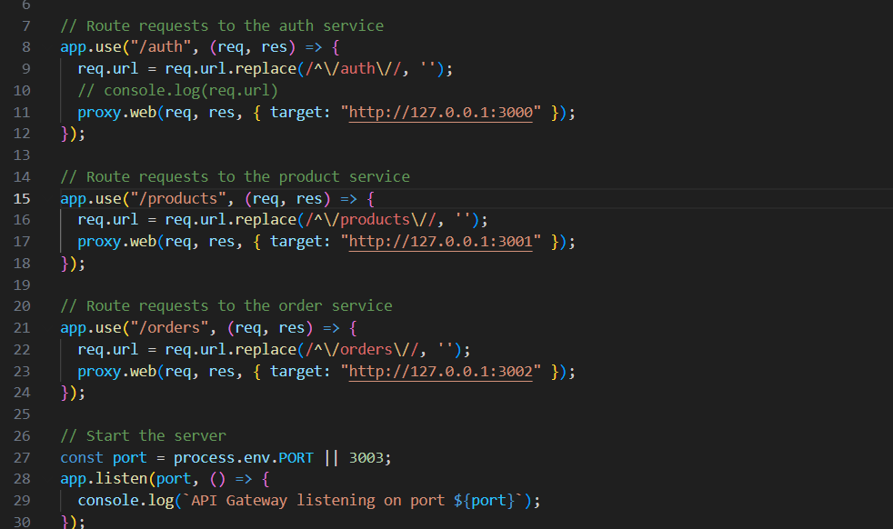
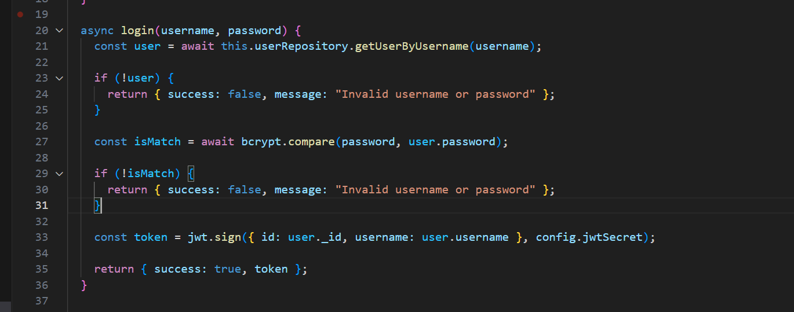
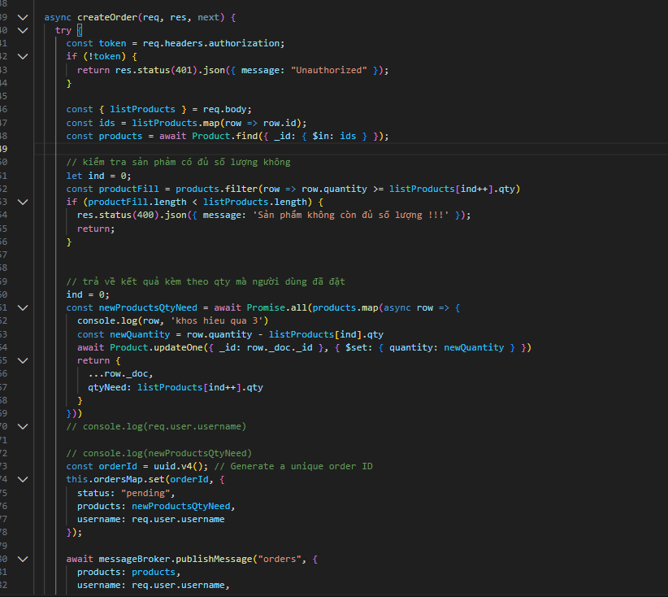
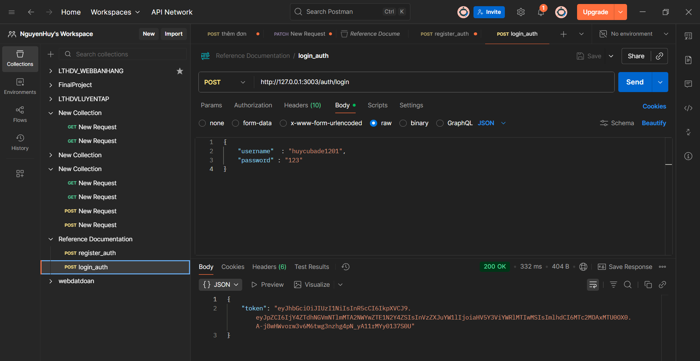
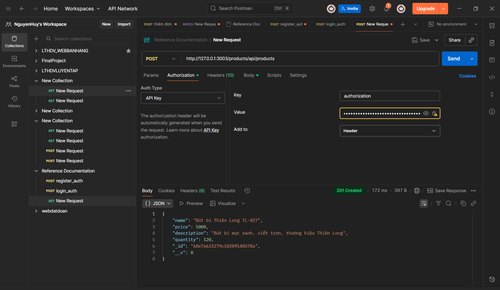
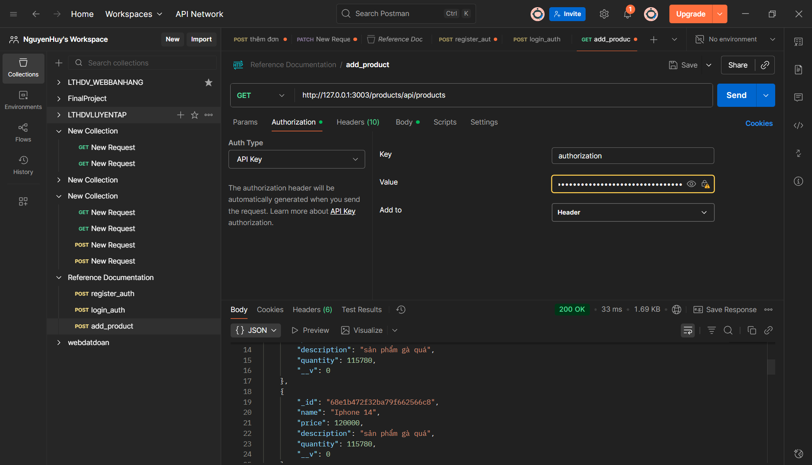
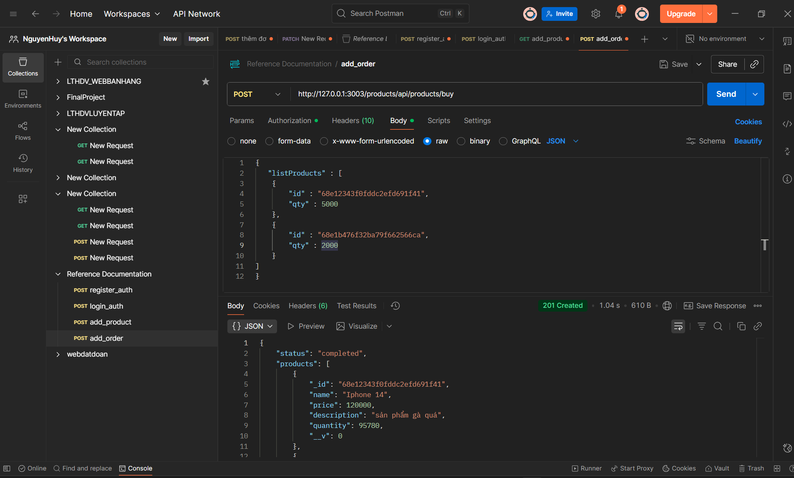

SET UP RABBITMQ TRÊN DOCKER
  

CHỈNH LẠI ĐƯỜNG DẪN CHO API GATEWAY ĐỂ ĐIỀU HƯỚNG ĐÚNG

THÊM THÔNG TIN ĐĂNG NHẬP ĐỂ KÝ TẠO MÃ JWT

THÊM CÁC ĐOẠN CODE PHỤC VỤ CHO CASESTUDY

TEST API ĐĂNG KÝ TÀI KHOẢN

TEST API ĐĂNG NHẬP TÀI KHOẢN

TEST API THÊM SẢN PHẨM

TEST API XEM TOÀN BỘ SẢN PHẨM

TEST API THÊM ĐƠN HÀNG

