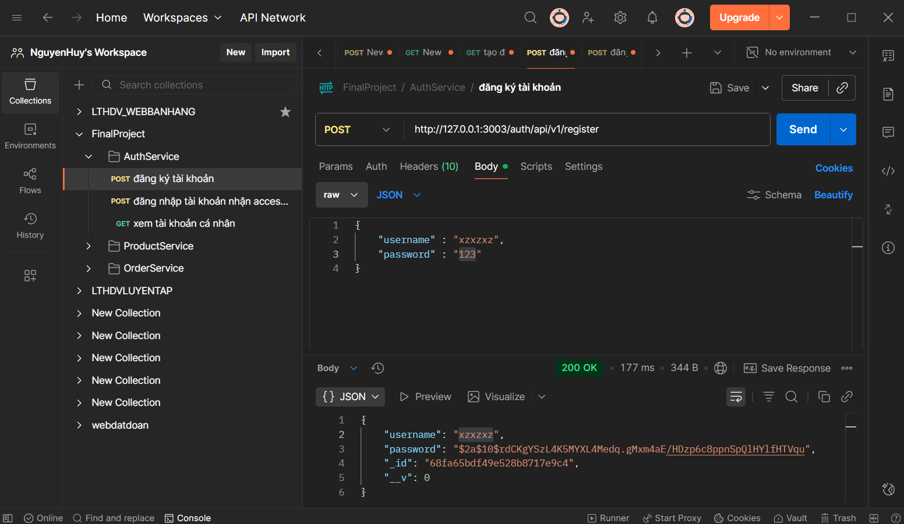
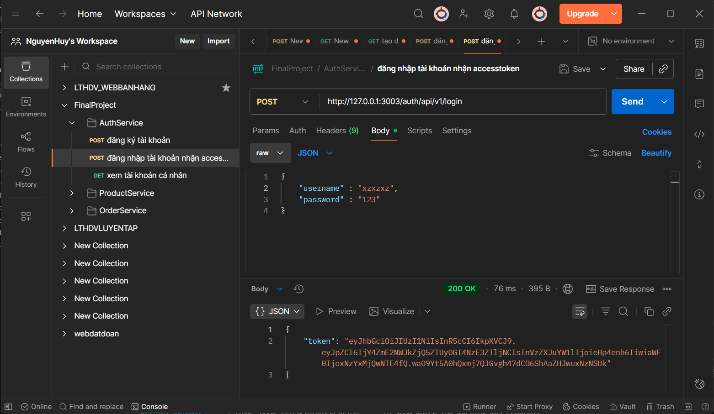
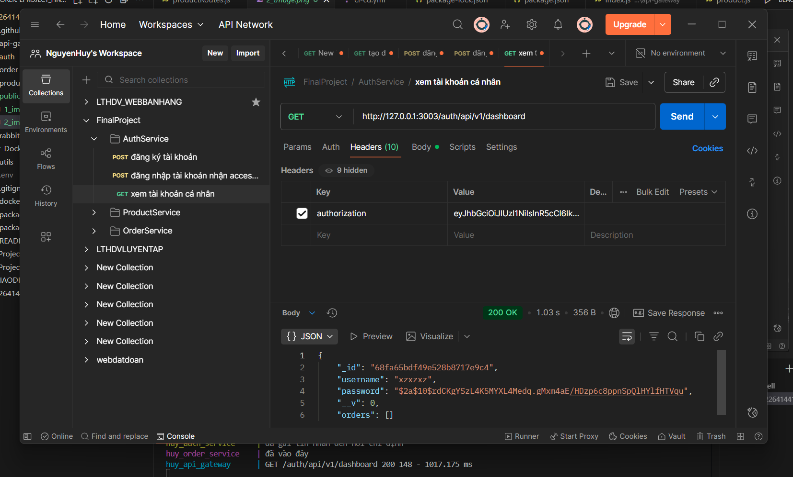
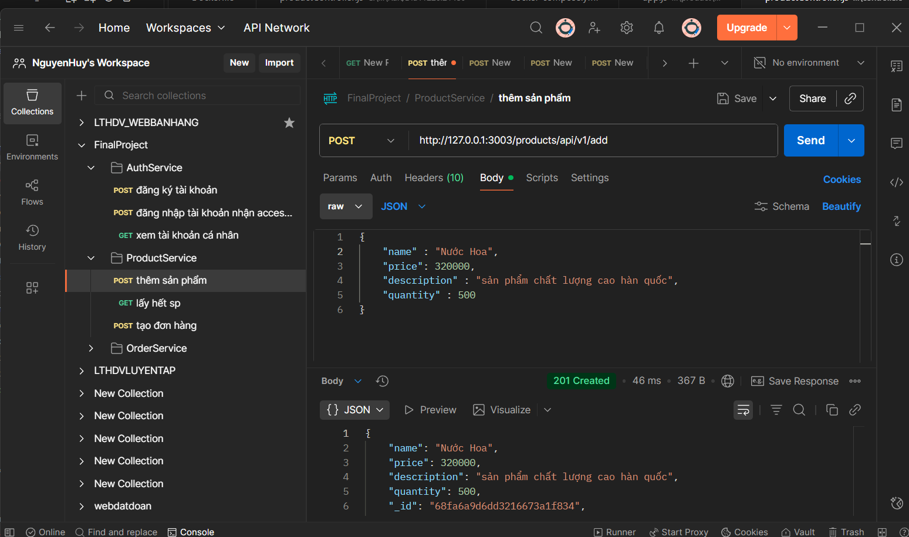
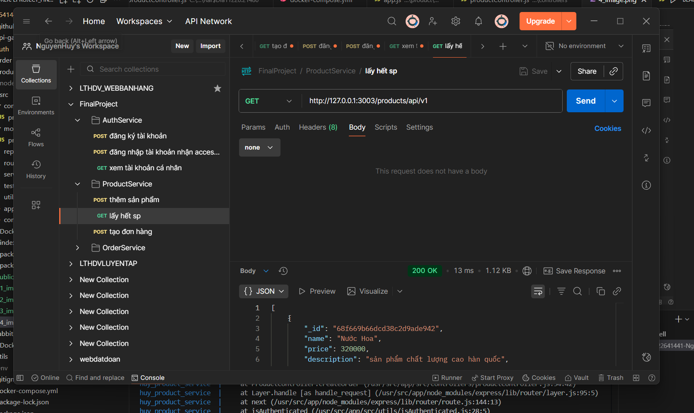
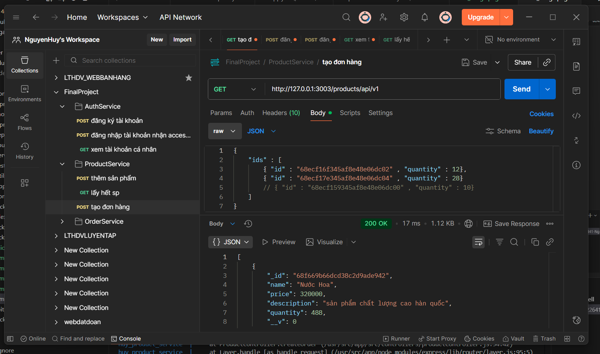
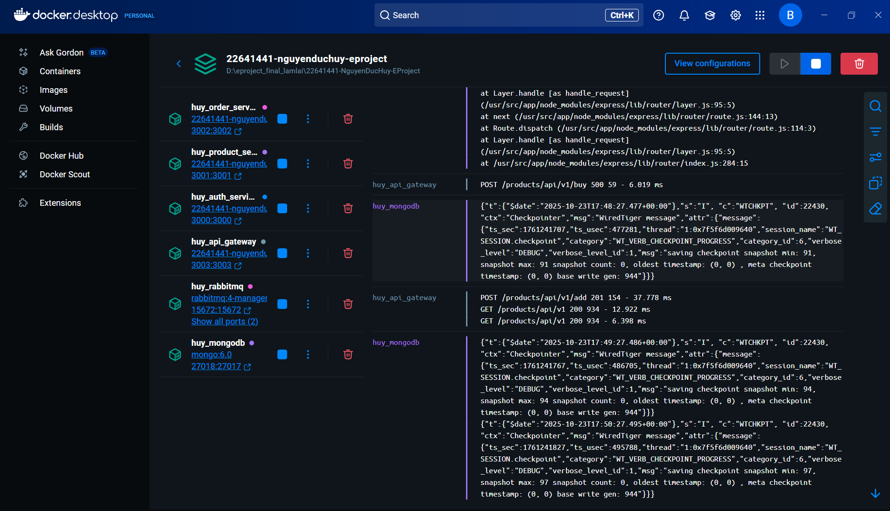

# 🚀 HỆ THỐNG API QUẢN LÝ SẢN PHẨM & ĐƠN HÀNG  

Dự án này là một hệ thống API RESTful hoàn chỉnh, được xây dựng nhằm mục đích **quản lý người dùng, sản phẩm và đơn hàng**.  
Toàn bộ hệ thống được **đóng gói bằng Docker** và tích hợp **CI/CD pipeline** để tự động hóa quá trình build, test và deploy.

---

## 🧱 CẤU TRÚC CHÍNH CỦA HỆ THỐNG

- **Ngôn ngữ & Framework:** Node.js / Express (hoặc framework tương ứng)  
- **Cơ sở dữ liệu:** MongoDB / MySQL / PostgreSQL  
- **Container hóa:** Docker & Docker Compose  
- **CI/CD:** GitHub Actions   
- **API Authentication:** JWT (JSON Web Token)  

---

## ⚙️ CÁC CHỨC NĂNG CHÍNH ĐƯỢC TEST

### 1️⃣ Đăng ký tài khoản  
Người dùng có thể tạo tài khoản mới thông qua API `/api/auth/register`.  
> **Ảnh minh chứng:**  
> 

---

### 2️⃣ Đăng nhập và nhận token  
Sau khi đăng nhập thành công qua `/api/auth/login`, hệ thống trả về **JWT Token** để xác thực các request tiếp theo.  
> **Ảnh minh chứng:**  
> 

---

### 3️⃣ Xem thông tin tài khoản  
Người dùng có thể dùng **JWT token** để lấy thông tin cá nhân tại `/api/user/me`.  
> **Ảnh minh chứng:**  
> 

---

### 4️⃣ Thêm sản phẩm mới  
API `/api/products/add` cho phép thêm sản phẩm mới vào hệ thống.  
> **Ảnh minh chứng:**  
> 

---

### 5️⃣ Lấy danh sách tất cả sản phẩm  
API `/api/products/all` giúp lấy danh sách sản phẩm có trong hệ thống.  
> **Ảnh minh chứng:**  
> 

---

### 6️⃣ Tạo đơn hàng mới  
API `/api/orders/create` cho phép người dùng tạo đơn hàng mới.  
> **Ảnh minh chứng:**  
> 

---

## 🐳 Triển khai bằng Docker

Toàn bộ hệ thống được đóng gói trong **Docker** để đảm bảo tính đồng nhất giữa các môi trường phát triển, test và production.  

> **Ảnh minh chứng:**  
> 

### Cách chạy dự án:
```bash
# 1. Build image
docker compose up --build

# 2. Chạy hệ thống
docker compose up 

# 3. Kiểm tra container
docker ps
